# 🏗️ ArcGIS Dynamic Schedule & Automated Gantt Visualization

_A "Self-Healing" Construction Management Pipeline._

This repository hosts an end-to-end automated system that synchronizes, cleans, calculates, and visualizes complex construction schedules stored in **ArcGIS Feature Layers**. It serves as the bridge between raw field data and executive visualization.

---

## 📖 Table of Contents

- [🚀 Project Overview](#-project-overview)
- [🗺️ System Architecture](#️-system-architecture)
- [📂 Repository Structure](#-repository-structure)
- [🧠 Script Modules Detailed](#-script-modules-detailed)
  - [1. The Orchestrator (Auto_Workflow.py)](#1-the-orchestrator-auto_workflowpy)
  - [2. The Logic Engine (Day_Dynamic_Computing.py)](#2-the-logic-engine-day_dynamic_computingpy)
  - [3. The Visualizer (Gantt_Chart.py)](#3-the-visualizer-gantt_chartpy)
- [🤖 CI/CD Automation](#-cicd-automation)
- [⚡ Local Installation & Setup](#-local-installation--setup)
- [🛠️ Configuration](#️-configuration)
- [📊 Frontend Visualization](#-frontend-visualization)
- [📄 License](#-license)

---

## 🚀 Project Overview

In large-scale construction projects, schedules are dynamic. A delay in one task (e.g., **"Foundation Pouring"**) inevitably impacts downstream tasks (e.g., **"Wall Framing"**).

This system solves the synchronization problem by running a nightly ETL (Extract, Transform, Load) pipeline that:

1. **Extracts** raw task data from ArcGIS Online.  
2. **Cleans** logical errors (e.g., tasks scheduled to start before their predecessors finish).  
3. **Calculates** the cascade effect of delays using a **Directed Acyclic Graph (DAG)** algorithm.  
4. **Updates** the ArcGIS database with the new, realistic dates.  
5. **Generates** a JSON dataset for a web-based Gantt Chart.

---

## 🗺️ System Architecture

The workflow is designed to be fail-safe. The visualization generation (**Step 2**) only executes if the logic calculation (**Step 1**) completes successfully.

```mermaid
graph TD
    %% Nodes
    A[📅 Daily Trigger<br>02:00 UTC] -->|GitHub Actions| B(Auto_Workflow.py)
    B -->|Phase 1: Compute| C{Day_Dynamic_Computing.py}

    C <-->|Read/Write JSON| D[(ArcGIS Feature Layer)]

    C -->|❌ Error| F[Abort Pipeline]
    C -->|✅ Success| E[Phase 2: Visualize]

    E -->|Run Script| G{Gantt_Chart.py}
    G <-->|Read Data| D

    G -->|Generate| H[docs/data.json]
    H -->|Git Commit| I[GitHub Pages Build]
    I -->|Deploy| J[Web Gantt Chart]

    %% Styling
    style A fill:#2d3436,stroke:#fff,color:#fff
    style B fill:#0984e3,stroke:#fff,color:#fff
    style C fill:#d63031,stroke:#fff,color:#fff
    style D fill:#2ecc71,stroke:#fff,color:#fff
    style G fill:#6c5ce7,stroke:#fff,color:#fff
    style J fill:#fdcb6e,stroke:#333,color:#333
```



---

## 📂 Repository Structure

```text
.
├── .github/
│   └── workflows/
│       └── schedule.yml        # The heartbeat: GitHub Actions configuration
├── docs/
│   ├── index.html              # Frontend: dhtmlxGantt visualization container
│   ├── style.css               # Frontend: Custom styling for the chart
│   └── data.json               # OUTPUT: The generated data fed to the website
├── Auto_Workflow.py            # SCRIPT: Main entry point / pipeline controller
├── Day_Dynamic_Computing.py    # SCRIPT: Mathematical core (DAG & logic)
├── Gantt_Chart.py              # SCRIPT: Data formatter & JSON generator
├── requirements.txt            # Python dependencies (pandas, arcgis, etc.)
└── README.md                   # Documentation
```

---

## 🧠 Script Modules Detailed

### 1. The Orchestrator (Auto_Workflow.py)

**Role:** The Controller / Gatekeeper.  

This script ensures the integrity of the pipeline. It is the file executed by GitHub Actions.

- **Sequential Execution:** Imports and runs the computing module first.  
- **Error Handling:** Wraps the execution in `try/except` blocks. If `Day_Dynamic_Computing.py` raises an exception (e.g., API connection failure, circular dependency detected), the workflow halts.

**Why is this crucial?**  
It prevents `Gantt_Chart.py` from running on corrupt or outdated data. We would rather show **yesterday's correct chart** than **today's broken one**.

---

### 2. The Logic Engine (Day_Dynamic_Computing.py)

**Role:** The Brain — logic processing & database writing.  

This is the most complex script in the repository. It performs "surgery" on the schedule data.

#### Key Algorithms

**Time-Travel Paradox Removal**

- **Problem:** Sometimes users accidentally schedule Task B (successor) to start before Task A (predecessor) finishes.  
- **Solution:** The script scans all relationships. If `Predecessor.PlanStart > Current.PlanStart`, the dependency link is deemed invalid and strictly removed from the `PreIDs` field in ArcGIS.

**DAG Propagation (The Cascade Effect)**

- Builds a simplified graph of tasks in memory.  
- Performs a **Topological Sort** to ensure calculations happen in the correct order (Parents → Children → Grandchildren).

**The Golden Rule:**

```text
New_Actual_Start = Max(Planned_Start, Max(All_Predecessors_Finish_Dates))
```

If a task is delayed, this logic pushes all dependent tasks forward in time automatically.

**Smart Write-Back**

To save API calls and ensure traceability, the script only updates the ArcGIS Feature Layer if the calculated dates differ from the stored dates by **more than 60 seconds**.

---

### 3. The Visualizer (Gantt_Chart.py)

**Role:** The Reporter — data transformation.  

This script takes the clean data and formats it for the frontend UI.

#### Hierarchical Structuring

It organizes flat database rows into a tree structure:

- 🟢 **Project** (Root)  
- 🔵 **Object / Phase** (Branch)  
- 🟣 **Task / WorkStation** (Leaf)  

#### Visual Flagging

- Compares `ActualStart` vs `PlannedStart`.  
- If `Actual > Planned`, the item is marked as **Delayed**, often rendering in 🔴 red on the frontend.

#### Output

Generates `docs/data.json`, a static file optimized for **low-latency loading** on the web.

---

## 🤖 CI/CD Automation

The system runs on **GitHub Actions**, defined in `.github/workflows/schedule.yml`.

### Workflow Triggers

- **Scheduled:** Runs automatically every day at `02:00 UTC`.  
- **Manual:** Supports `workflow_dispatch`, allowing administrators to trigger a recalculation immediately via the GitHub UI.

### The Pipeline Steps

1. **Environment Setup:** Boots an `ubuntu-latest` runner.  
2. **Dependency Install:** Installs Python 3.10, `pandas`, and `arcgis`.  
3. **Authentication:** Retrieves `ARCGIS_USERNAME` and `ARCGIS_PASSWORD` from GitHub Repository Secrets.  
4. **Execution:** Runs `python Auto_Workflow.py`.  
5. **Deployment:**
   - Checks if `docs/data.json` has changed.  
   - If changed, commits the file to the `main` branch.  
   - This commit automatically triggers a GitHub Pages rebuild.

---

## ⚡ Local Installation & Setup

If you wish to run or modify this pipeline on your local machine:

### 1. Clone the Repository

```bash
git clone https://github.com/YOUR_USERNAME/YOUR_REPO_NAME.git
cd YOUR_REPO_NAME
```

### 2. Install Dependencies

```bash
pip install -r requirements.txt
```

> Key libraries include: `pandas` and `arcgis`.

### 3. Set Environment Variables

You must configure your ArcGIS credentials.

**macOS / Linux:**

```bash
export ARCGIS_USERNAME="your_username"
export ARCGIS_PASSWORD="your_password"
```

**Windows (PowerShell):**

```powershell
$env:ARCGIS_USERNAME="your_username"
$env:ARCGIS_PASSWORD="your_password"
```

### 4. Run the Pipeline

```bash
python Auto_Workflow.py
```

---

## 🛠️ Configuration

### Environment Variables

These must be set in your OS (locally) or in **Settings → Secrets and variables → Actions** (on GitHub).

| Variable          | Description                                                        | Required? |
|-------------------|--------------------------------------------------------------------|----------:|
| `ARCGIS_USERNAME` | The ArcGIS Online account with **Edit** permissions on the layer. | ✅        |
| `ARCGIS_PASSWORD` | The login password for the account.                               | ✅        |

---

## 📊 Frontend Visualization

The visualization is hosted via **GitHub Pages** from the `/docs` folder.

- **Library:** Uses `dhtmlxGantt` (Standard License / Open Source version).  
- **Data Source:** Reads directly from the generated `data.json`.  

### Interaction

- Users can expand/collapse **Project phases**.  
- Hovering over tasks shows detailed **start/end dates** and **delay status**.  
- The chart provides a **"live" view** of the construction site's progress.

---

## 📄 License

This project is licensed under the **MIT License** — see the `LICENSE` file for details.
